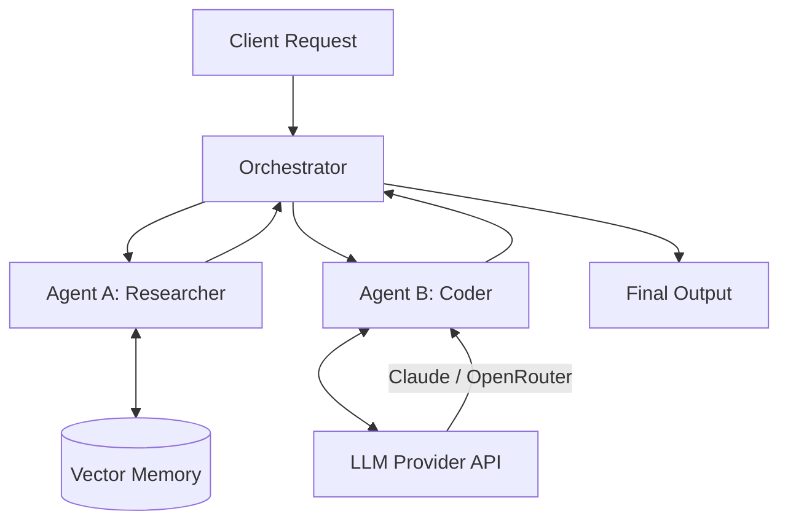

<div align="center">
  <!-- Place your 1280x640 social banner here -->
  
</div>

<div align="center">
  <br />
  <p>
    <b>Build, orchestrate, and deploy autonomous AI agents with ease.</b>
  </p>

  <p>
    <a href="https://github.com/mukulre/Agentic-AI-ADK/actions/workflows/ci.yml"></a>
    <a href="https://www.npmjs.com/package/agentic-ai-adk"></a>
    <a href="https://github.com/mukulre/Agentic-AI-ADK/blob/main/LICENSE"></a>
    <a href="https://github.com/mukulre/Agentic-AI-ADK/stargazers"></a>
  </p>
</div>

---

## ⚡ Why Agentic-AI-ADK?

Building multi-agent systems is often bogged down by complex orchestration and state management. **Agentic-AI-ADK** provides a lightweight, modular toolkit to bridge the gap between high-token LLMs (like Claude) and your application logic.

- 🧠 **Model Agnostic:** Seamless integration with OpenRouter, Anthropic, and OpenAI.
- 🔄 **Stateful Execution:** Built-in memory management for long-running agent tasks.
- 🛠️ **Extensible Tools:** Easily equip agents with custom Node.js functions.
- 🔒 **Type-Safe:** Written completely in TypeScript for robust development.

## 📸 See it in Action

*(Place a high-quality GIF here showing the terminal output of two agents debating a topic or solving a coding problem).*
``

## 🏗️ Architecture



## 🚀 Installation

```bash
npm install agentic-ai-adk
```

## 💻 Quick Start

```typescript
import { Agent, Orchestrator } from 'agentic-ai-adk';

// Initialize a reasoning agent
const researcher = new Agent({
  name: 'Researcher',
  role: 'Data Gathering',
  model: 'claude-3-opus',
  provider: 'openrouter',
  apiKey: process.env.OPENROUTER_API_KEY
});

// Run a task
const result = await researcher.execute("Find the latest advancements in local LLM deployment.");
console.log(result);
```

## 📚 Documentation
For API references, advanced orchestration, and tool creation, visit our [GitHub Pages Landing Page](https://mukulre.github.io/Agentic-AI-ADK).

## 🤝 Contributing
Read our [Contributing Guide](CONTRIBUTING.md) to learn about our development process, how to propose bugfixes and improvements, and how to build and test your changes to Agentic-AI-ADK.

## 📜 License
MIT © Mukul Raj
